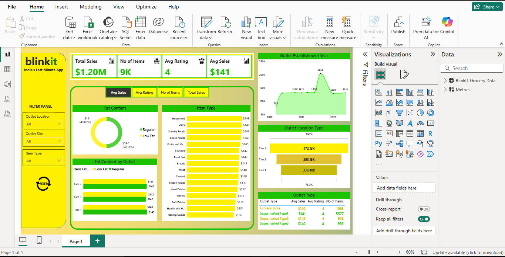

# 📊 Blinkit Data Analysis Dashboard (Power BI)

This project is a **Power BI Dashboard** built to analyze Blinkit (India’s Last Minute App) sales data. The dashboard provides key insights into sales, items, ratings, and outlet performance.

---

## 🚀 Project Overview
The goal of this project is to explore and visualize Blinkit’s grocery sales data to identify trends and patterns that help in decision-making.  
The analysis focuses on overall performance, outlet types, item types, and customer ratings.

---

## 📌 Key Metrics Displayed
- **Total Sales**: `$1.20M`  
- **No of Items**: `9K`  
- **Average Rating**: `4`  
- **Average Sales per Item**: `$141`  

---

## 📊 Dashboard Features
1. **KPI Cards**  
   - Total Sales  
   - Number of Items  
   - Average Rating  
   - Average Sales  

2. **Filters**  
   - Outlet Location  
   - Outlet Size  
   - Item Type  

3. **Visuals**  
   - **Fat Content Analysis**: Distribution of Regular vs Low Fat items.  
   - **Item Type Sales**: Average sales by item type (Household, Dairy, Snacks, etc.).  
   - **Outlet Establishment Year**: Trend of sales by outlet year.  
   - **Outlet Location Type**: Sales contribution from Tier 1, Tier 2, and Tier 3 cities.  
   - **Outlet Type Comparison**: Performance by Grocery Store, Supermarket Type1, Type2, and Type3.  

---

## 🛠 Tools & Technologies Used
- **Power BI** – Dashboard & Visualization  
- **Dataset** – Blinkit Grocery Sales Data   

---

## 📷 Dashboard Snapshot

---

## 📌 Insights Gained
- Tier 3 outlets contribute the highest sales (`472K`).  
- Regular and Low-Fat items contribute almost equally to sales.  
- Household and Dairy items have the highest average sales.  
- Average product rating is consistent across outlet types.  

